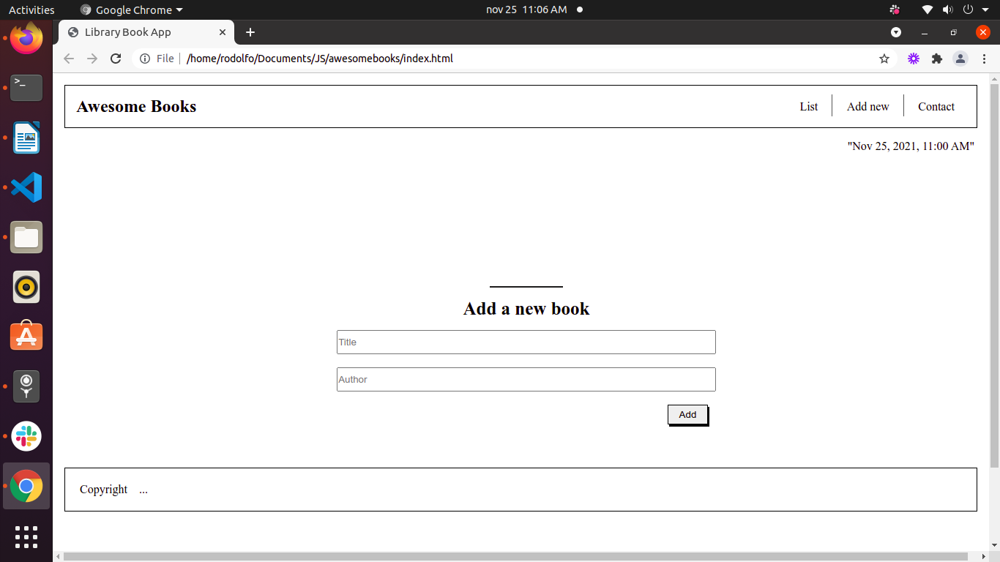

# AWESOME BOOKS

> Awesome books" is a simple website that displays a list of books and allows you to add and remove books from that list. In order to achieve this project we rewrote some of our function definitions into class expressions to apply JavaScript best practices and styling the core elements.


### ScreenShoot



## Built With

- HTML
- CSS 
- JavaScript
- Linters
- Vscode

## Live Demo

[Live Demo](https://debas-31.github.io/awesomebooks/)

## Getting Started

To get a local copy up and running follow these simple example steps.

### Prerequisites

- Node and NPM
- Web browser (Google chrome)
- Code Editor (VSCode)

### Development (Running locally)

- git clone the project

```bash 
git clone git@github.com:Debas-31/awesomebooks.git
```

- Install Dependencies

```bash
npm install
```

To run StyleLint by itself, you may run the lint task:

```bash
npx stylelint "**/*.{css,scss}"
```

Or to automatically fix issues found (where possible):

```bash
npx stylelint "**/*.{css,scss}" --fix
```

You can also check against Webhint:

```bash
npx hint --telemetry=off .
```

👤 **Debas Gebreslasie**

- [GitHub](https://github.com/Debas-31)
- [Twitter](https://twitter.com/DEBSH76956492)
- [LinkedIn](https://www.linkedin.com/in/debas-gebrengus)

  
  ## 👤 **Rodolfo**

- Github: [@RadiactiveJesus](https://github.com/RadiactiveJesus)
- Twitter: [@LlinasCuadro](https://twitter.com/LlinasCuadro)
- Linkedin: [Rodolfo Llinás](https://www.linkedin.com/in/rodolfo-llin%C3%A1s-691b50181/)


## 🤝 Contributing

Contributions, issues and feature requests are welcome!

Feel free to check the [issues page](https://github.com/Debas-31/awesomebooks/issues).

## Show your support

Give a ⭐️ if you like this project!

## Acknowledgments

- Hat tip to anyone whose code was used
- Inspiration, resources/assets used
- etc

## 📝 License

[MIT licensed](https://github.com/Debas-31/awesomebooks/blob/Milestone-1-manage-book-collection/MIT.md).
